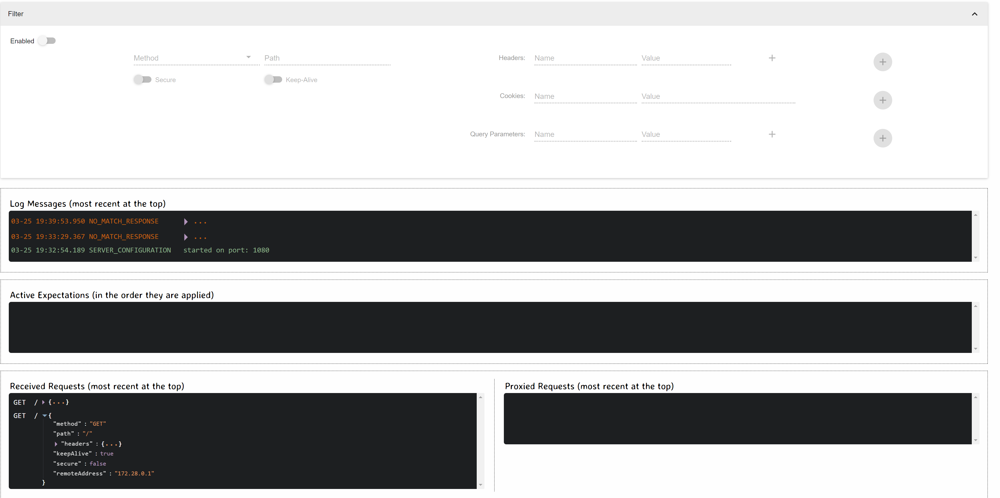

# Mock Server

This is a quick way to help you set up a mock server that you can point your apps too. This allows for faster testing. This

- minimises setup time of a mock server
- stops you from using online websites which can leak client credentials
- does not need the internet to work 


## Setup
```
docker-compose up -d
docker ps
```


Then you can run requests to it, try some post and get requests with

View logs while you run requests

```
docker logs -f local-mock-server
```

It even has a UI!

http://localhost:9999/mockserver/dashboard


# Clean
```
docker stop local-mock-server
docker rm local-mock-server
```


